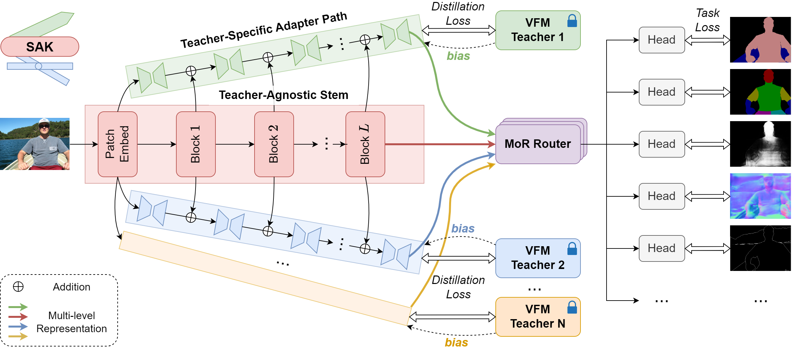

<p align="center">
  <h1 align="center">Swiss Army Knife: <ins>S</ins>ynergizing Bi<ins>A</ins>s in <ins>K</ins>nowledge from Vision Foundation Models for Multi-Task Learning</h1>
  <p align="center">
    <strong><a href="https://innovator-zero.github.io/">Yuxiang Lu</a><sup>*</sup></strong>
    &nbsp;&nbsp;
    <strong><a href="https://shengcao.netlify.app/">Shengcao Cao</a><sup>*</sup></strong>
    &nbsp;&nbsp;
    <strong><a href="https://yxw.web.illinois.edu/">Yu-Xiong Wang</a></strong>
  </p>

  <p align="center">
  <a href="https://openreview.net/forum?id=eePww5u7J3"></a>
  <a href="https://arxiv.org/abs/2410.14633"></a>
  <a href="https://innovator-zero.github.io/SAK/"></a>
  </p>
</p>

## TL;DR
Different foundation models excel at different tasks &mdash; what if we could combine their strengths?

**Introducing *SAK*: a "Swiss Army Knife" approach that preserve and exploit the unique representation biases of each model during distillation, optimizing their power for multiple downstream tasks.**



## 🔥 News
- [2025.02.26] Code released.

## ✨ Abstract

Vision Foundation Models (VFMs) have demonstrated outstanding performance on numerous downstream tasks. However, due to their inherent representation biases originating from different training paradigms, VFMs exhibit advantages and disadvantages across distinct vision tasks. Although amalgamating the strengths of multiple VFMs for downstream tasks is an intuitive strategy, effectively exploiting these biases remains a significant challenge. In this paper, we propose a novel and versatile "Swiss Army Knife" (SAK) solution, which adaptively distills knowledge from a committee of VFMs to enhance multi-task learning. Unlike existing methods that use a single backbone for knowledge transfer, our approach preserves the unique representation bias of each teacher by collaborating the lightweight Teacher-Specific Adapter Path modules with the Teacher-Agnostic Stem. Through dynamic selection and combination of representations with Mixture-of-Representations Routers, our SAK is capable of synergizing the complementary strengths of multiple VFMs. Extensive experiments show that our SAK remarkably outperforms prior state of the arts in multi-task learning by 10% on the NYUD-v2 benchmark, while also providing a flexible and robust framework that can readily accommodate more advanced model designs.

## ⚙️ Setup

### Requirements
The following environment has been tested and recommended, you can use pypi to install the requirements:
```
conda create -n sak python=3.10
pip install -r requirements.txt
```

### Datasets
In stage 1, we use the ImageNet-1k (ILSVRC-2012) dataset for distillation, which can be downloaded from the [official website](http://www.image-net.org/). We use a modified dataloader, you could change it in `datasets/imagenet.py`.

In stage 2, we use the PASCAL-Context and NYUD-v2 datasets for learning multiple downstream tasks.The two datasets can be downloaded from the google drive: [PASCAL-Context](https://drive.google.com/file/d/1TWZydr5_r4hKDM5Zyzrcq712Stg2cw7p/view?usp=drive_link), [NYUD-v2](https://drive.google.com/file/d/1rj3tHdQVYqe-Y3mpxv4EgWsiqgq3z87H/view?usp=drive_link).

You should place three datasets in the same directory, and specify the path to the directory as `db_root` variable in `datasets/utils/mypath.py`.

### Pre-trained Models
We will provide the pre-trained SAK models soon.

## 🚀 Usage

The config files of our models are defined in `configs/`, with `s1` and `s2` for stage 1 and stage 2, respectively. We provide some examples and you can modify the teachers, architectures, hyperparameters, and output directory (`results_dir`).

### Train 

**Stage 1**
```
torchrun --nproc_per_node=8 train_s1.py --config_path $PATH_TO_CONFIG_FILE --exp $EXP_NAME
```

**Stage 2**
```
torchrun --nproc_per_node=2 train_s2.py --config_path $PATH_TO_CONFIG_FILE --exp $EXP_NAME --checkpoint $PATH_TO_CHECKPOINT --task_out
```

`$PATH_TO_CONFIG_FILE` is the path to the config file, and `$EXP_NAME` is the name of the experiment. The config file and checkpoints will be saved in `$results_dir/$EXP_NAME`. 

There are some arguments you can specify in the command line, including `--seed $SEED` to set a seed, `--wandb_name $WANDB_NAME` to log with [wandb](https://wandb.ai/site), `--checkpoint $PATH_TO_CHECKPOINT` to load a checkpoint (typically for stage 2), `--resume` to resume training with saved optimizer and scheduler, and `--fp16` to use mixed precision training.

There are two arguments only for stage 2, including `--task_out` to train the model with task-specific output heads, and `--alpha $ALPHA` to balance the distillation loss and the task losses.

### Test

```
python test.py --exp $EXP_NAME --results_dir $RESULTS_DIR --evaluate
```
`$EXP_NAME` is the name of the experiment specified when training stage 2, and `$RESULTS_DIR` is the output directory specified in config file. When `--evaluate` is used, the model will be evaluated on all tasks, and the predictions for boundary will be saved. When `--save` is used, the predictions for all tasks will be saved. The predictions will be saved in `$RESULTS_DIR/$EXP_NAME/predictions`. You can specify the gpu to use by `--gpu_id $GPU`.

#### Boundary evaluation
To evaluate the object boundary/edge detection result, a evaluation tool is needed to calculate optimal-dataset-scale F-measure (odsF), which is modified from [SEISM](https://github.com/jponttuset/seism) project. Specfically, we use maxDist=0.0075 for PASCAL-Context and maxDist=0.011 for NYUD-v2, following the previous works.

You can follow the steps below:

1. The prediction images should be saved in the directory `$RESULTS_DIR/$EXP_NAME/predictions/edge/img/` after running `test.py`.
2. The SEISM project is based on MATLAB, make sure you have MATLAB installed.
3. Clone our modified version of SEISM into `evaluation/` folder:
```
cd evaluation
git clone https://github.com/innovator-zero/seism.git
```
4. Modify the `seism/src/gt_wrappers/db_root_dir.m` to specify the path to the dataset.
5. Run the following command to perform pre-processing and evaluation:
```
cd evaluation
python edge_evaluation.py --exp $EXP_NAME --results_dir $RESULTS_DIR --dataset $DATASET --nms
```
Multiple `$EXP_NAME` can be specified and evaluated sequentially (should share the same dataset), `$DATASET` is either `PASCALContext` or `NYUD`, `--nms` firstly applies non-maximum suppression (NMS) processing to the predictions, the processed images will be saved in `$RESULTS_DIR/$EXP_NAME/predictions/edge/nms/`.

6. Get the evaluation results by running the following command:
```
python edge_evaluation.py --exp $EXP_NAME --results_dir $RESULTS_DIR --dataset $DATASET --done
```
You can also find detailed results in `$RESULTS_DIR/$EXP_NAME/predictions/edge_test.txt`.

## 🙏 Acknowledgement

Our implementation is based on our [MTDP_Lib](https://github.com/innovator-zero/MTDP_Lib), which is a simple code base for multi-task dense prediction methods.

We also thank following code repositories for supporting the backbones and baselines: [timm](), [RADIO](https://github.com/NVlabs/RADIO), [Theia](https://github.com/bdaiinstitute/theia).

## 📖 Citation

```
@inproceedings{lu2025swiss,
  title={Swiss Army Knife: Synergizing Biases in Knowledge from Vision Foundation Models for Multi-Task Learning},
  author={Yuxiang Lu and Shengcao Cao and Yu-Xiong Wang},
  booktitle={The Thirteenth International Conference on Learning Representations},
  year={2025}
}
```